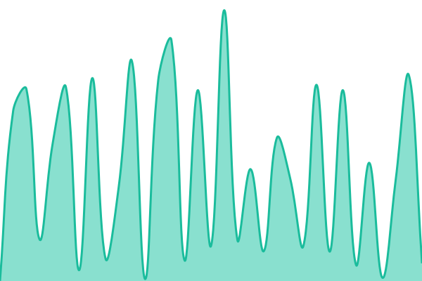
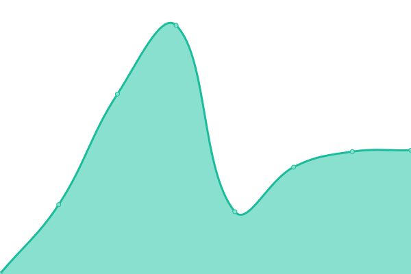
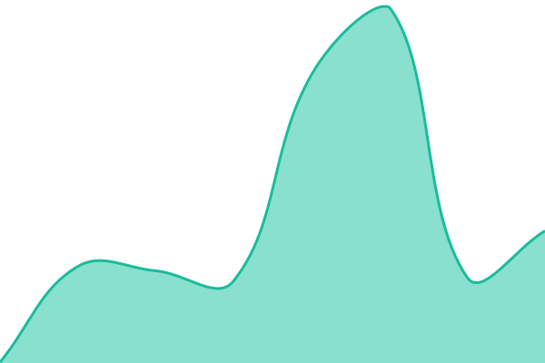
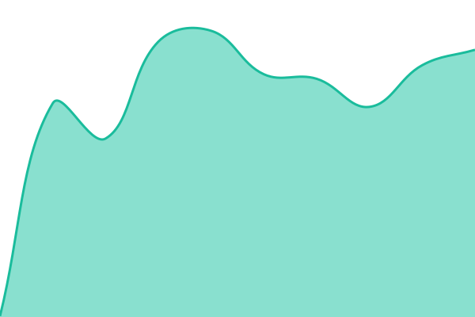
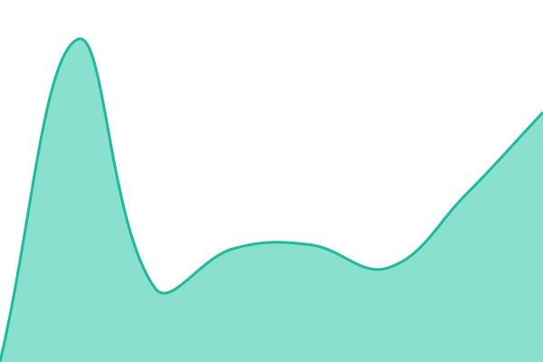

# [📈 Live Status](https://demo.upptime.js.org): <!--live status--> **🟧 Partial outage**

This repository contains the open-source uptime monitor and status page for [POC Uptime sites](https://demo.upptime.js.org), powered by [Upptime](https://github.com/upptime/upptime).

With [Upptime](https://upptime.js.org), you can get your own unlimited and free uptime monitor and status page, powered entirely by a GitHub repository. We use [Issues](https://github.com/POC Uptime sites/upptime/issues) as incident reports, [Actions](https://github.com/POC Uptime sites/upptime/actions) as uptime monitors, and [Pages](https://demo.upptime.js.org) for the status page.

<!--start: status pages-->
<!-- This summary is generated by Upptime (https://github.com/upptime/upptime) -->
<!-- Do not edit this manually, your changes will be overwritten -->
<!-- prettier-ignore -->
| URL | Status | History | Response Time | Uptime |
| --- | ------ | ------- | ------------- | ------ |
|  [Cascade Loans DinCloud](https://cascadeloans.dincloud.com/logon/LogonPoint/index.html) | 🟥 Down | [cascade-loans-din-cloud.yml](https://github.com/teodoromariano/upptime/commits/HEAD/history/cascade-loans-din-cloud.yml) | 

 0ms
     
 | 

<a href="https://teodoromariano.github.io/uptime/history/cascade-loans-din-cloud">0.00%</a>
    

|  [Cascade Loans Web Site](https://www.cascadeloans.com) | 🟩 Up | [cascade-loans-web-site.yml](https://github.com/teodoromariano/upptime/commits/HEAD/history/cascade-loans-web-site.yml) | 

 625ms
     
 | 

<a href="https://teodoromariano.github.io/uptime/history/cascade-loans-web-site">90.66%</a>
    

|  [Cascade Auth](https://cascadeauth.cascadeloans.com) | 🟩 Up | [cascade-auth.yml](https://github.com/teodoromariano/upptime/commits/HEAD/history/cascade-auth.yml) | 

 453ms
     
 | 

<a href="https://teodoromariano.github.io/uptime/history/cascade-auth">100.00%</a>
    

|  [Cascadeauth-ui](https://cascadeauth-ui.cascadeloans.com) | 🟩 Up | [cascadeauth-ui.yml](https://github.com/teodoromariano/upptime/commits/HEAD/history/cascadeauth-ui.yml) | 

 200ms
     
 | 

<a href="https://teodoromariano.github.io/uptime/history/cascadeauth-ui">100.00%</a>
    

|  [Encompass Production](https://BE799583.ea.elliemae.net) | 🟩 Up | [encompass-production.yml](https://github.com/teodoromariano/upptime/commits/HEAD/history/encompass-production.yml) | 

 236ms
     
 | 

<a href="https://teodoromariano.github.io/uptime/history/encompass-production">98.97%</a>
    

|  [Ask-cade2.com/home](https://www.ask-cade2.com) | 🟩 Up | [ask-cade2-com-home.yml](https://github.com/teodoromariano/upptime/commits/HEAD/history/ask-cade2-com-home.yml) | 

 342ms
     
 | 

<a href="https://teodoromariano.github.io/uptime/history/ask-cade2-com-home">100.00%</a>
    

<!--end: status pages-->

[**Visit our status website →**](https://demo.upptime.js.org)

## 📄 License

- Powered by: [Upptime](https://github.com/upptime/upptime)
- Code: [MIT](./LICENSE) © [POC Uptime sites](https://demo.upptime.js.org)
- Data in the `./history` directory: [Open Database License](https://opendatacommons.org/licenses/odbl/1-0/)
